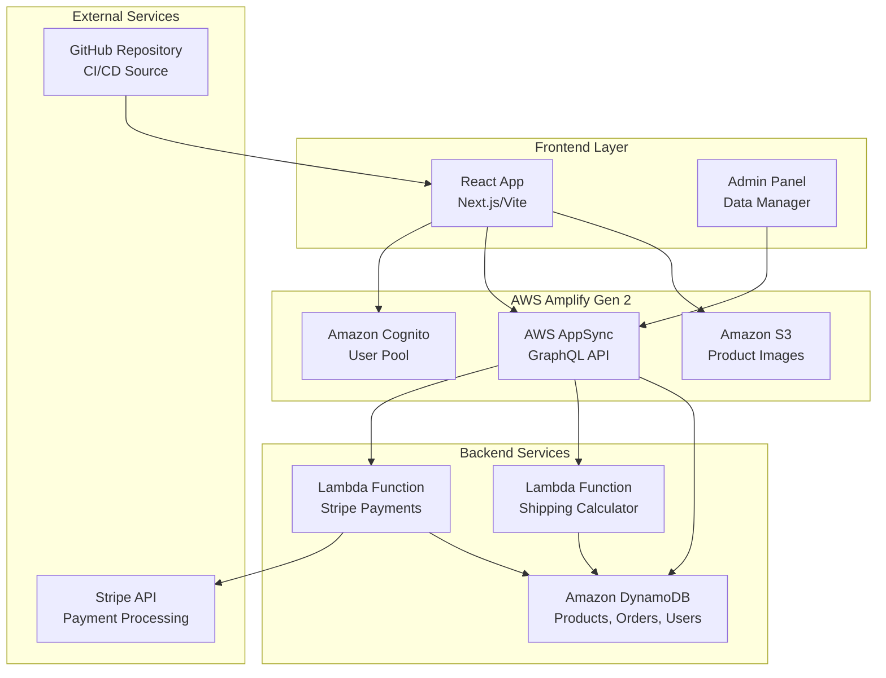

# Design Document: AWS Amplify Serverless Architecture

## Overview

Esta arquitectura serverless para Protex Wear utiliza AWS Amplify Gen 2 (code-first) para crear una solución completamente escalable y sin costes residuales. La arquitectura separa claramente las responsabilidades entre frontend (React), backend (GraphQL + Lambda), autenticación (Cognito), datos (DynamoDB) y almacenamiento (S3).

El diseño sigue los principios de AWS Well-Architected Framework, priorizando escalabilidad automática, seguridad por capas, y desarrollo ágil con CI/CD integrado.

## Architecture



## Components and Interfaces

### 1. Amplify Application Structure

```typescript
// amplify/resource.ts
import { defineBackend } from '@aws-amplify/backend';
import { auth } from './auth/resource';
import { data } from './data/resource';
import { storage } from './storage/resource';

export const backend = defineBackend({
  auth,
  data,
  storage,
});
```

### 2. Authentication Component (Cognito)

```typescript
// amplify/auth/resource.ts
import { defineAuth } from '@aws-amplify/backend';

export const auth = defineAuth({
  loginWith: {
    email: true,
  },
  userAttributes: {
    'custom:role': {
      dataType: 'String',
      mutable: true,
    },
  },
  groups: ['ADMIN', 'CUSTOMER'],
});
```

### 3. Data Models (DynamoDB)

```typescript
// amplify/data/resource.ts
import { type ClientSchema, a, defineData } from '@aws-amplify/backend';

const schema = a.schema({
  Product: a
    .model({
      sku: a.string().required(),
      name: a.string().required(),
      price: a.float().required(),
      stock: a.integer().required(),
      imageUrl: a.string(),
      category: a.string(),
      description: a.string(),
    })
    .authorization((allow) => [
      allow.publicApiKey().to(['read']),
      allow.group('ADMIN').to(['create', 'read', 'update', 'delete']),
    ]),

  Order: a
    .model({
      userId: a.string().required(),
      products: a.string().array(), // JSON string of products
      status: a.enum(['PENDING', 'PROCESSING', 'SHIPPED', 'DELIVERED', 'CANCELLED']),
      total: a.float().required(),
      shippingAddress: a.string(),
      createdAt: a.datetime(),
    })
    .authorization((allow) => [
      allow.authenticated().to(['create', 'read']),
      allow.group('ADMIN').to(['read', 'update']),
      allow.owner().to(['read']),
    ]),

  User: a
    .model({
      email: a.string().required(),
      role: a.enum(['ADMIN', 'CUSTOMER']),
      firstName: a.string(),
      lastName: a.string(),
      company: a.string(),
    })
    .authorization((allow) => [
      allow.owner().to(['read', 'update']),
      allow.group('ADMIN').to(['read', 'update']),
    ]),
});

export type Schema = ClientSchema<typeof schema>;
export const data = defineData({
  schema,
  authorizationModes: {
    defaultAuthorizationMode: 'apiKey',
    apiKeyAuthorizationMode: {
      expiresInDays: 30,
    },
  },
});
```

### 4. Storage Component (S3)

```typescript
// amplify/storage/resource.ts
import { defineStorage } from '@aws-amplify/backend';

export const storage = defineStorage({
  name: 'protexWearStorage',
  access: (allow) => ({
    'product-images/*': [
      allow.authenticated.to(['read', 'write', 'delete']),
      allow.guest.to(['read']),
    ],
  }),
});
```

### 5. Lambda Functions

```typescript
// amplify/functions/stripe-webhook/resource.ts
import { defineFunction } from '@aws-amplify/backend';

export const stripeWebhook = defineFunction({
  name: 'stripe-webhook',
  entry: './handler.ts',
  environment: {
    STRIPE_SECRET_KEY: process.env.STRIPE_SECRET_KEY!,
  },
});

// amplify/functions/shipping-calculator/resource.ts
export const shippingCalculator = defineFunction({
  name: 'shipping-calculator',
  entry: './handler.ts',
});
```

### 6. Frontend Integration

```typescript
// src/lib/amplify.ts
import { Amplify } from 'aws-amplify';
import { generateClient } from 'aws-amplify/data';
import type { Schema } from '../../amplify/data/resource';
import outputs from '../../amplify_outputs.json';

Amplify.configure(outputs);

export const client = generateClient<Schema>();
```

## Data Models

### Product Model
```typescript
interface Product {
  id: string;
  sku: string;
  name: string;
  price: number;
  stock: number;
  imageUrl?: string;
  category?: string;
  description?: string;
  createdAt: string;
  updatedAt: string;
}
```

### Order Model
```typescript
interface Order {
  id: string;
  userId: string;
  products: OrderItem[];
  status: 'PENDING' | 'PROCESSING' | 'SHIPPED' | 'DELIVERED' | 'CANCELLED';
  total: number;
  shippingAddress: string;
  createdAt: string;
  updatedAt: string;
}

interface OrderItem {
  productId: string;
  quantity: number;
  price: number;
}
```

### User Model
```typescript
interface User {
  id: string;
  email: string;
  role: 'ADMIN' | 'CUSTOMER';
  firstName?: string;
  lastName?: string;
  company?: string;
  createdAt: string;
  updatedAt: string;
}
```

## Correctness Properties

*A property is a characteristic or behavior that should hold true across all valid executions of a system-essentially, a formal statement about what the system should do. Properties serve as the bridge between human-readable specifications and machine-verifiable correctness guarantees.*

### Converting EARS to Properties

Basándome en el análisis de prework, convierto los criterios de aceptación testables en propiedades universales:

**Property 1: User Role Assignment**
*For any* user registration, the system should assign the 'CUSTOMER' role by default unless explicitly specified otherwise
**Validates: Requirements 2.2**

**Property 2: JWT Token Generation**
*For any* authenticated user, the system should provide valid JWT tokens that can be used for API authorization
**Validates: Requirements 2.5**

**Property 3: GraphQL Authorization Rules**
*For any* GraphQL operation, the system should enforce the correct authorization rules: public API key for reading products, authenticated access for creating orders, and admin role for product management
**Validates: Requirements 4.2, 4.3, 4.4, 8.4**

**Property 4: Image URL Generation**
*For any* uploaded image to S3, the system should generate a publicly accessible URL that can be used by the frontend
**Validates: Requirements 5.2**

**Property 5: Product-Image Cleanup**
*For any* product deletion, the system should automatically remove all associated images from S3 storage
**Validates: Requirements 5.3**

**Property 6: Product-Image Integration**
*For any* product with an associated image, the system should maintain the correct reference between the product record and its image URL
**Validates: Requirements 5.5**

**Property 7: Stripe Payment Processing**
*For any* payment webhook from Stripe, the system should correctly process the payment and update the corresponding order status
**Validates: Requirements 7.2**

**Property 8: Shipping Calculation**
*For any* shipping calculation request with valid location and weight data, the system should return a consistent and accurate shipping cost
**Validates: Requirements 7.3**

**Property 9: Data Migration File Reading**
*For any* valid JSON/CSV file provided to the migration script, the system should successfully parse and extract all records
**Validates: Requirements 9.1**

**Property 10: Data Migration Insertion**
*For any* valid data record processed by the migration script, the system should successfully insert it into DynamoDB using the AWS SDK
**Validates: Requirements 9.2**

**Property 11: Migration Error Handling**
*For any* error encountered during migration, the system should log the error details and continue processing the remaining records
**Validates: Requirements 9.3**

**Property 12: Data Validation**
*For any* data record processed by the migration script, the system should validate the structure before attempting insertion
**Validates: Requirements 9.4**

**Property 13: Migration Reporting**
*For any* completed migration process, the system should provide accurate statistics of successful and failed record insertions
**Validates: Requirements 9.5**

## Error Handling

### Authentication Errors
- **Invalid Credentials**: Return clear error messages for login failures
- **Token Expiration**: Automatically refresh tokens or redirect to login
- **Unauthorized Access**: Return 403 errors with appropriate messages

### API Errors
- **GraphQL Validation**: Return detailed validation errors for malformed queries
- **Rate Limiting**: Implement throttling for API requests
- **Network Failures**: Implement retry logic with exponential backoff

### Data Errors
- **DynamoDB Failures**: Handle capacity exceeded and throttling errors
- **S3 Upload Failures**: Retry failed uploads and provide user feedback
- **Migration Errors**: Log detailed error information and continue processing

### Lambda Function Errors
- **Stripe Webhook Failures**: Implement idempotency and retry logic
- **Shipping Calculation Errors**: Provide fallback shipping rates
- **Timeout Handling**: Implement appropriate timeout values and error responses

## Testing Strategy

### Dual Testing Approach
This system requires both unit tests and property-based tests for comprehensive coverage:

**Unit Tests** focus on:
- Specific examples of authentication flows
- Integration points between Amplify services
- Edge cases in Lambda functions
- Error conditions and boundary values

**Property Tests** focus on:
- Universal properties that hold across all inputs
- Authorization rule enforcement across different user types
- Data consistency between services
- Migration script behavior with various data formats

### Property-Based Testing Configuration
- **Testing Framework**: Use `fast-check` for JavaScript/TypeScript property-based testing
- **Minimum Iterations**: 100 iterations per property test
- **Test Tagging**: Each property test must reference its design document property
- **Tag Format**: **Feature: amplify-serverless-architecture, Property {number}: {property_text}**

### Testing Tools and Libraries
- **Unit Testing**: Jest with AWS SDK mocks
- **Property Testing**: fast-check for universal property validation
- **Integration Testing**: AWS CDK assertions for infrastructure testing
- **E2E Testing**: Cypress for frontend user flows

### Test Organization
```
tests/
├── unit/
│   ├── auth/
│   ├── data/
│   ├── storage/
│   └── functions/
├── properties/
│   ├── auth.properties.test.ts
│   ├── data.properties.test.ts
│   ├── storage.properties.test.ts
│   └── migration.properties.test.ts
└── integration/
    ├── api.integration.test.ts
    └── deployment.integration.test.ts
```

### Continuous Testing
- **Pre-commit**: Run unit tests and linting
- **Pull Request**: Run full test suite including property tests
- **Deployment**: Run integration tests in staging environment
- **Production**: Monitor with CloudWatch and automated alerts