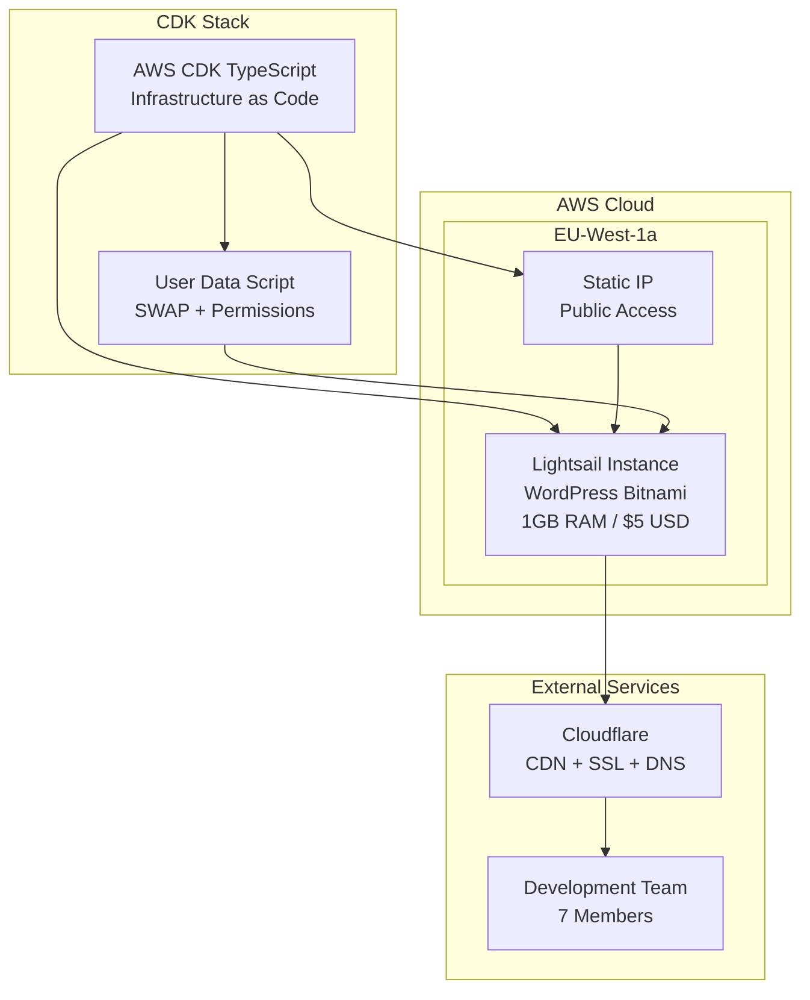

# Design Document: AWS CDK Infrastructure

## Overview

Este diseño implementa una infraestructura de bajo coste para Protex Wear usando AWS CDK con TypeScript. La solución se basa en una arquitectura "monolito optimizado" usando AWS Lightsail para minimizar costes operativos (~$5-10 USD/mes) mientras proporciona una base sólida y reproducible para el e-commerce.

La infraestructura incluye una instancia Lightsail con WordPress/WooCommerce preconfigurado, IP estática para integración con Cloudflare, y configuración automática de SWAP y permisos para soportar operaciones de importación masiva de datos.

## Architecture

### High-Level Architecture



### Component Architecture

La infraestructura se compone de tres componentes principales:

1. **CDK Stack Principal**: Orquesta todos los recursos AWS
2. **Lightsail Instance**: Servidor principal con WordPress
3. **Networking Layer**: IP estática y configuración de red

## Components and Interfaces

### CDK Stack Component

**Responsabilidad**: Definir y desplegar toda la infraestructura AWS

**Interfaces**:
- Input: Configuración de parámetros (región, tipo de instancia, zona AZ)
- Output: IP estática pública, información de acceso

**Implementación**:
```typescript
export class ProtexWearInfraStack extends Stack {
  constructor(scope: Construct, id: string, props?: StackProps) {
    // Configuración de la instancia Lightsail
    // Creación de IP estática
    // Asociación de IP a instancia
    // Configuración de outputs
  }
}
```

### Lightsail Instance Component

**Responsabilidad**: Servidor principal que ejecuta WordPress/WooCommerce

**Especificaciones**:
- Blueprint: 'wordpress' (Bitnami certified)
- Bundle: 'nano_3_0' (1GB RAM, $5 USD/mes)
- Availability Zone: 'eu-west-1a'
- User Data: Script de inicialización automática

**Configuración**:
```typescript
const instance = new lightsail.CfnInstance(this, 'ProtexWearInstance', {
  blueprintId: 'wordpress',
  bundleId: 'nano_3_0',
  availabilityZone: 'eu-west-1a',
  instanceName: 'protex-wear-wordpress',
  userData: userDataScript
});
```

### Static IP Component

**Responsabilidad**: Proporcionar IP pública fija para DNS

**Configuración**:
```typescript
const staticIp = new lightsail.CfnStaticIp(this, 'ProtexWearStaticIp', {
  staticIpName: 'protex-wear-static-ip'
});

const attachment = new lightsail.CfnStaticIpAttachment(this, 'StaticIpAttachment', {
  staticIpName: staticIp.staticIpName,
  instanceName: instance.instanceName
});
```

### User Data Script Component

**Responsabilidad**: Configuración automática de SWAP y permisos

**Script de inicialización**:
```bash
#!/bin/bash
# 1. Crear SWAP de 2GB (Vital para evitar OOM Kills con 1GB RAM)
fallocate -l 2G /swapfile
chmod 600 /swapfile
mkswap /swapfile
swapon /swapfile
echo '/swapfile none swap sw 0 0' >> /etc/fstab

# 2. Ajuste de permisos (Best practice Bitnami)
chown -R bitnami:daemon /opt/bitnami/wordpress/wp-content
chmod -R g+w /opt/bitnami/wordpress/wp-content
```

## Data Models

### Stack Configuration Model

```typescript
interface ProtexWearStackConfig {
  instanceName: string;
  blueprintId: 'wordpress';
  bundleId: 'nano_3_0';
  availabilityZone: string;
  staticIpName: string;
}
```

### Output Model

```typescript
interface StackOutputs {
  staticIpAddress: string;
  instanceName: string;
  sshCommand: string;
  wordpressUrl: string;
  credentialsCommand: string;
}
```

## Correctness Properties

*A property is a characteristic or behavior that should hold true across all valid executions of a system-essentially, a formal statement about what the system should do. Properties serve as the bridge between human-readable specifications and machine-verifiable correctness guarantees.*

### Converting EARS to Properties

Basándome en el análisis de prework, he identificado las propiedades testeable y eliminado redundancias. Las propiedades 1.1 y 1.4 se solapan (ambas sobre imagen WordPress), las propiedades 2.3 y 6.1 son idénticas (IP como output), y las propiedades de configuración SWAP y permisos pueden consolidarse.

**Property 1: Lightsail Instance Configuration**
*For any* valid CDK deployment, the created Lightsail instance should have blueprint 'wordpress', bundleId 'nano_3_0', and be located in availability zone 'eu-west-1a'
**Validates: Requirements 1.1, 1.2, 1.3, 1.4**

**Property 2: Static IP Creation and Association**
*For any* CDK stack deployment, a static IP should be created and correctly associated with the Lightsail instance
**Validates: Requirements 2.1, 2.2**

**Property 3: Stack Output Completeness**
*For any* successful CDK deployment, the stack outputs should include the static IP address and access information
**Validates: Requirements 2.3, 6.1, 6.2**

**Property 4: User Data Script SWAP Configuration**
*For any* generated user data script, it should contain all necessary commands to create, configure, and permanently enable a 2GB SWAP file
**Validates: Requirements 3.1, 3.2, 3.3**

**Property 5: User Data Script Bitnami Permissions**
*For any* generated user data script, it should contain commands to set correct ownership (bitnami:daemon) and group write permissions on wp-content directory recursively
**Validates: Requirements 4.1, 4.2, 4.3**

**Property 6: User Data Script Integration**
*For any* Lightsail instance configuration, the user data script should be properly attached and configured to execute on first boot
**Validates: Requirements 3.4**

**Property 7: CDK Idempotency**
*For any* CDK stack, running cdk deploy multiple times should produce the same infrastructure state without errors
**Validates: Requirements 5.1**

**Property 8: Resource Cleanup**
*For any* CDK stack, running cdk destroy should remove all created resources while preserving any critical persistent data
**Validates: Requirements 5.2**

## Error Handling

### Deployment Failures

**Instance Creation Failures**:
- Verificar disponibilidad de blueprint 'wordpress' en la región
- Validar que bundleId 'nano_3_0' está disponible
- Manejar errores de zona de disponibilidad no disponible

**Static IP Failures**:
- Verificar límites de IPs estáticas en la cuenta AWS
- Manejar conflictos de nombres de recursos
- Validar permisos IAM para crear recursos Lightsail

**User Data Script Failures**:
- Validar sintaxis del script bash antes del despliegue
- Incluir logging en el script para debugging
- Proporcionar comandos para verificar ejecución del script

### Runtime Errors

**Memory Issues**:
- El script SWAP debe ejecutarse antes de cualquier operación intensiva
- Monitorear uso de memoria durante importación de datos
- Proporcionar comandos para verificar estado del SWAP

**Permission Issues**:
- Verificar que los permisos Bitnami se aplican correctamente
- Proporcionar comandos de diagnóstico para permisos
- Documentar cómo corregir permisos manualmente si es necesario

## Testing Strategy

### Unit Testing Approach

**CDK Construct Testing**:
- Usar AWS CDK Testing Library para verificar recursos generados
- Testear que el template CloudFormation contiene los recursos esperados
- Verificar propiedades específicas de cada recurso (blueprint, bundle, AZ)

**User Data Script Testing**:
- Testear que el script contiene todos los comandos necesarios
- Verificar sintaxis bash del script generado
- Testear que los comandos SWAP y permisos están presentes

### Property-Based Testing Configuration

**Testing Framework**: AWS CDK Testing Library con Jest
**Minimum Iterations**: 100 per property test
**Test Tagging**: Each test must reference its design document property

**Property Test Examples**:
```typescript
// Feature: aws-cdk-infrastructure, Property 1: Lightsail Instance Configuration
test('Lightsail instance has correct configuration', () => {
  const template = Template.fromStack(stack);
  template.hasResourceProperties('AWS::Lightsail::Instance', {
    BlueprintId: 'wordpress',
    BundleId: 'nano_3_0',
    AvailabilityZone: 'eu-west-1a'
  });
});

// Feature: aws-cdk-infrastructure, Property 4: User Data Script SWAP Configuration
test('User data script contains SWAP configuration', () => {
  const userData = generateUserDataScript();
  expect(userData).toContain('fallocate -l 2G /swapfile');
  expect(userData).toContain('chmod 600 /swapfile');
  expect(userData).toContain('swapon /swapfile');
  expect(userData).toContain('/etc/fstab');
});
```

### Integration Testing

**End-to-End Deployment Testing**:
- Testear despliegue completo en entorno de desarrollo
- Verificar que la instancia es accesible vía SSH
- Validar que WordPress está funcionando correctamente
- Testear que el SWAP está activo y los permisos son correctos

**Idempotency Testing**:
- Ejecutar múltiples despliegues consecutivos
- Verificar que no se crean recursos duplicados
- Validar que los outputs permanecen consistentes

### Manual Verification Steps

**Post-Deployment Checklist**:
1. Verificar que la IP estática está asignada correctamente
2. Conectar vía SSH y verificar credenciales Bitnami
3. Comprobar que el SWAP está activo: `swapon --show`
4. Verificar permisos en wp-content: `ls -la /opt/bitnami/wordpress/`
5. Acceder a WordPress vía navegador web
6. Verificar que WooCommerce está disponible

**Troubleshooting Commands**:
```bash
# Verificar estado del SWAP
swapon --show
free -h

# Verificar permisos Bitnami
ls -la /opt/bitnami/wordpress/wp-content/

# Obtener credenciales WordPress
cat /home/bitnami/bitnami_credentials

# Verificar logs de inicialización
sudo tail -f /var/log/cloud-init-output.log
```