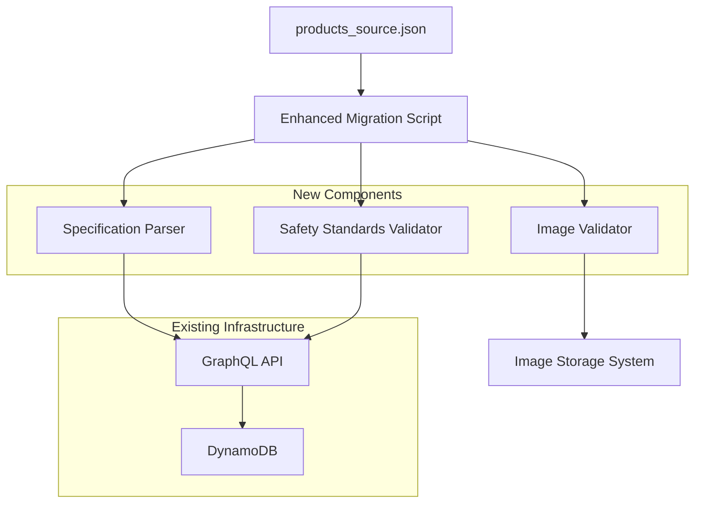

# Design Document

## Overview

This design enhances the existing product migration system to handle complex industrial safety equipment (EPIs) with comprehensive regulatory compliance data. The solution extends the current seed.ts script and products_source.json structure to support nested specifications, robust image management, and industrial-grade data validation.

## Architecture

The enhanced migration system maintains the existing architecture while adding specialized components for industrial product handling:



## Components and Interfaces

### Enhanced Specification Parser

**Purpose**: Parse and validate complex nested JSON specifications containing safety standards, sizes, and technical details.

**Interface**:
```typescript
interface SpecificationParser {
  parseSpecifications(specs: Record<string, any>): ParsedSpecifications;
  validateSafetyStandards(standards: string[]): ValidationResult;
  validateSizeInformation(sizes: string[] | Record<string, any>): ValidationResult;
}

interface ParsedSpecifications {
  safetyStandards: SafetyStandard[];
  sizeInformation: SizeInfo;
  technicalDetails: Record<string, any>;
  protectionLevels: ProtectionLevel[];
}
```

### Image Management System

**Purpose**: Handle image URL validation, path resolution, and provide guidance for proper image storage.

**Interface**:
```typescript
interface ImageManager {
  validateImageUrls(urls: string[]): ImageValidationResult;
  resolveImagePaths(urls: string[], environment: 'development' | 'production'): string[];
  getStorageRecommendations(): StorageRecommendations;
}

interface StorageRecommendations {
  developmentPath: string;
  productionPath: string;
  supportedFormats: string[];
  maxFileSize: number;
}
```

### Safety Standards Validator

**Purpose**: Validate industrial safety standards and ensure compliance data integrity.

**Interface**:
```typescript
interface SafetyValidator {
  validateEN388(specification: EN388Spec): ValidationResult;
  validateS3Classification(specification: S3Spec): ValidationResult;
  validateVisibilityStandards(specification: VisibilitySpec): ValidationResult;
}

interface EN388Spec {
  abrasionLevel: number; // 1-4
  cutLevel: number; // 1-5
  tearLevel: number; // 1-4
  punctureLevel: number; // 1-4
  cutLevelTDM?: string; // A-F (optional)
  impactProtection?: boolean;
}
```

## Data Models

### Enhanced Product Source Structure

```typescript
interface IndustrialProductSource extends ProductSource {
  specifications: IndustrialSpecifications;
  safetyCategory: 'EPI' | 'STANDARD';
  complianceRequired: boolean;
}

interface IndustrialSpecifications {
  // Safety Standards
  safetyStandards: SafetyStandard[];
  
  // Size Information
  sizeInformation?: {
    type: 'numeric' | 'alphanumeric' | 'european';
    availableSizes: string[];
    sizeChart?: Record<string, any>;
  };
  
  // Protection Levels
  protectionLevels?: {
    category: string; // S1, S2, S3, etc.
    certifications: string[];
    performanceRatings: Record<string, number>;
  };
  
  // Technical Specifications
  technicalDetails: {
    material?: string;
    weight?: string;
    dimensions?: Record<string, any>;
    features?: string[];
    usage?: string[];
  };
  
  // Regulatory Information
  regulatoryInfo?: {
    ceMarking: boolean;
    manufacturerInfo: string;
    testReports?: string[];
  };
}

interface SafetyStandard {
  code: string; // EN 388, EN ISO 20345, etc.
  description: string;
  levels?: Record<string, any>; // Specific performance levels
  mandatory: boolean;
}
```

### Template Examples Structure

The system will generate three representative examples:

1. **Protective Glove (EN 388)**:
```json
{
  "specifications": {
    "safetyStandards": [
      {
        "code": "EN 388",
        "description": "Protective gloves against mechanical risks",
        "levels": {
          "abrasion": 4,
          "cut": 3,
          "tear": 4,
          "puncture": 2,
          "cutTDM": "C",
          "impact": true
        },
        "mandatory": true
      }
    ],
    "sizeInformation": {
      "type": "numeric",
      "availableSizes": ["7", "8", "9", "10", "11"]
    }
  }
}
```

2. **Safety Shoe (S3)**:
```json
{
  "specifications": {
    "safetyStandards": [
      {
        "code": "EN ISO 20345",
        "description": "Safety footwear",
        "levels": {
          "category": "S3",
          "steelToe": "200J",
          "punctureResistance": "1100N",
          "waterResistance": true
        },
        "mandatory": true
      }
    ],
    "sizeInformation": {
      "type": "european",
      "availableSizes": ["38", "39", "40", "41", "42", "43", "44", "45", "46", "47"]
    }
  }
}
```

3. **High-Visibility Garment**:
```json
{
  "specifications": {
    "safetyStandards": [
      {
        "code": "EN ISO 20471",
        "description": "High visibility clothing",
        "levels": {
          "class": "2",
          "reflectiveTapeWidth": "50mm",
          "backgroundMaterial": "fluorescent"
        },
        "mandatory": true
      }
    ],
    "sizeInformation": {
      "type": "alphanumeric",
      "availableSizes": ["S", "M", "L", "XL", "XXL"]
    }
  }
}
```

## Image Storage Strategy

### Recommended Directory Structure

Based on Amplify best practices, the recommended structure is:

```
public/
├── images/
│   ├── products/
│   │   ├── gloves/
│   │   ├── shoes/
│   │   ├── clothing/
│   │   └── equipment/
│   └── placeholders/
│       └── no-image.jpg
```

### Image URL Resolution

- **Development**: `/images/products/{category}/{filename}`
- **Production**: `https://{amplify-domain}/images/products/{category}/{filename}`
- **Fallback**: `/images/placeholders/no-image.jpg`

### Image Validation Rules

- Supported formats: JPG, PNG, WebP
- Maximum file size: 2MB per image
- Recommended dimensions: 800x600px minimum
- File naming convention: `{sku}-{variant}.{extension}`

## Error Handling

### Specification Validation Errors

```typescript
interface SpecificationError {
  field: string;
  value: any;
  expectedFormat: string;
  severity: 'warning' | 'error' | 'critical';
  message: string;
}
```

### Image Validation Errors

```typescript
interface ImageError {
  url: string;
  errorType: 'invalid_format' | 'unreachable' | 'too_large' | 'missing';
  fallbackAction: 'use_placeholder' | 'skip_image' | 'fail_product';
  message: string;
}
```

### Recovery Strategies

1. **Specification Errors**: 
   - Warning: Log and continue with available data
   - Error: Use default values where possible
   - Critical: Reject product and log detailed error

2. **Image Errors**:
   - Invalid URL: Use placeholder image
   - Missing file: Continue without image
   - Format issues: Log warning and attempt processing

3. **Safety Standard Errors**:
   - Missing mandatory standards: Reject product
   - Invalid levels: Use closest valid level and log warning
   - Unknown standards: Log warning and store as-is

## Correctness Properties

*A property is a characteristic or behavior that should hold true across all valid executions of a system-essentially, a formal statement about what the system should do. Properties serve as the bridge between human-readable specifications and machine-verifiable correctness guarantees.*

### Property 1: Specification Round-Trip Integrity
*For any* valid industrial product specification object, serializing then deserializing should produce an equivalent specification with all nested structures, safety standards, and technical details preserved.
**Validates: Requirements 1.1, 1.5, 5.1**

### Property 2: Safety Standards Preservation
*For any* product specification containing valid safety standards (EN 388, S3, etc.), the Migration_System should correctly identify, validate, and preserve all regulatory compliance information without data loss.
**Validates: Requirements 1.2**

### Property 3: Size Information Integrity
*For any* product specification containing size information, the complete size range data structure should be maintained regardless of size format type (numeric, alphanumeric, european).
**Validates: Requirements 1.3**

### Property 4: Protection Level Accuracy
*For any* product specification containing protection levels, the protection classification data should be stored accurately with all performance ratings and certifications preserved.
**Validates: Requirements 1.4**

### Property 5: Image Processing Robustness
*For any* array of image URLs containing a mix of valid, invalid, local, or placeholder URLs, the Migration_System should process all entries gracefully, continue operation without failure, and provide appropriate fallbacks for invalid entries.
**Validates: Requirements 2.1, 2.2, 2.5**

### Property 6: Default Value Assignment
*For any* product with null or empty image URLs, the system should assign appropriate default values and continue processing successfully.
**Validates: Requirements 2.3**

### Property 7: Template Structure Validation
*For any* generated product template, each product category should demonstrate proper specification structure with all required fields for that category type.
**Validates: Requirements 3.5**

### Property 8: EPI Validation Completeness
*For any* EPI product, the Validation_Engine should verify all required safety standard fields, validate size format consistency, and confirm protection level classifications match industry standards.
**Validates: Requirements 4.1, 4.2, 4.3**

### Property 9: Validation Error Handling
*For any* product with critical safety information validation failures, the system should reject the product and provide specific, detailed error messages for each validation failure type.
**Validates: Requirements 4.4, 4.5**

### Property 10: Error Recovery and Continuation
*For any* batch of products containing malformed specification data, the system should attempt recovery, log detailed error information, continue processing remaining valid products, and provide comprehensive error reporting.
**Validates: Requirements 5.2, 5.5**

### Property 11: Progress Reporting Consistency
*For any* product processing operation, the Migration_System should provide detailed progress reporting that accurately reflects the current processing state.
**Validates: Requirements 5.4**

### Property 12: Image Path Resolution
*For any* combination of storage location and deployment environment (development/production), the Image_Manager should generate correct URL references and handle path resolution appropriately.
**Validates: Requirements 6.2, 6.3, 6.4**

### Property 13: Image Validation Completeness
*For any* image file during migration, the system should validate file format and size constraints, providing clear validation results for each image.
**Validates: Requirements 6.5**

## Testing Strategy

### Unit Testing

Unit tests will focus on specific examples and edge cases:
- **Template Generation**: Verify the three specific EPI examples (glove with EN 388, shoe with S3, high-visibility garment) are generated correctly
- **Error Conditions**: Test specific error scenarios and recovery mechanisms
- **Integration Points**: Test component interactions and data flow

### Property-Based Testing

Property-based testing will validate universal correctness properties using **fast-check** library with minimum 100 iterations per test. Each property test must reference its design document property using the tag format:

**Feature: industrial-products-migration, Property {number}: {property_text}**

**Dual Testing Approach**: Both unit tests and property tests are required and complementary. Unit tests catch concrete bugs and verify specific examples, while property tests verify general correctness across all inputs, providing comprehensive coverage together.